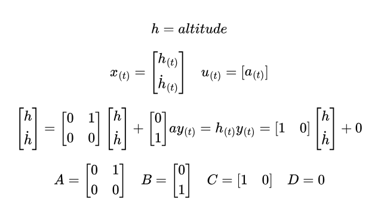
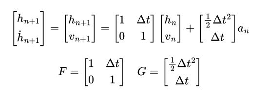

# Kalman Filter Based on Model mk. 2
This Kalman filter is part of a engineering thesis at the end of my bachelor degree of Automatic Contrioll and Robotics (Automatyka i Robotyka) on Poznan University of Technology.

## Project description
### Starting the project
To start the project, run python script 'main.py'.

### Project elements
* **main.py** - main script of the project
* **KalmanFilter_class.py** - Kalman Filter class with linear KF equations
* **noise_adder.py** - file for adding noise to measurements
* **Hexa4+_tp02-alt-acc.csv** - file with simulated measurements of altitude and acceleration
* **config.py** - file with configuration of the project
* **model.py** - file with only model equations of rocket

## Engineering Thesis descripion
The main goal of the thesis is to create an algorithm to detect a rocket apogee with barometric measurements. To achieve this goal, an altitude must be estimated with use of fine-tuned Kalman Filter. This thesis part of project of PUT Rocketlab Student Group. The algorithm will be used during the Spaceport America Cup - an amateur rocketry competition.

## Kalman Filter description
The Kalman filter is based on the model mk. 2 from my private notes.
The model is based on the differential equation of an object, where the state vector consists of position and velocity. The input to the model is simulated acceleration with noise. The measurements are values of simulated altitude with noise.
The filter and model was developed with help of the guidebook "Kalman Filter From The Ground-Up".

## Measurements
Measurements in "Hexa4+_tp02-alt-acc.csv" file were generated by model in Open Rocket software.

## Model
The model has been derived from the state space representation of dynamic object moving in one dimension - estimation of rocket heigth.

With given matrices A, B, C, D the differential equation can be solved and written as:

## TO DO:
Improve the Q, P and R matrices, add noise artefacts in transonic region of height estimation, later add measurements from preasure measurements with simulated noise. Increase noise of acceleration. Think about EKF or UKF.
